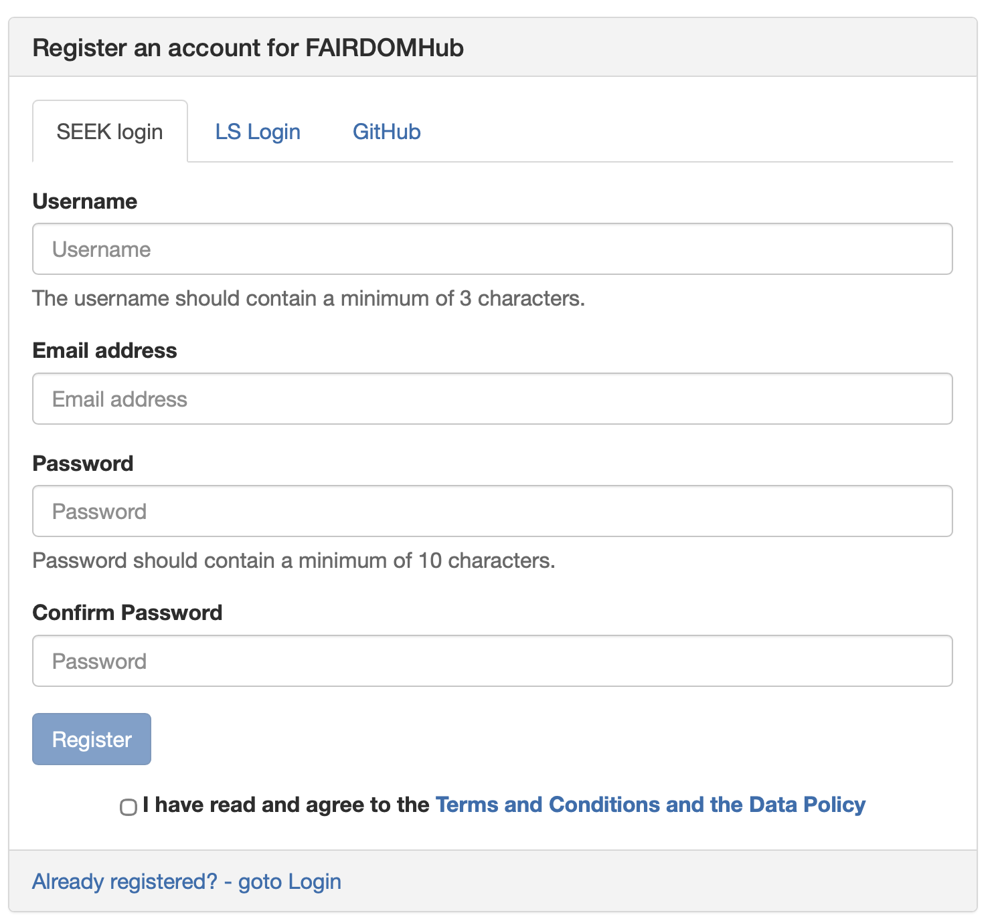
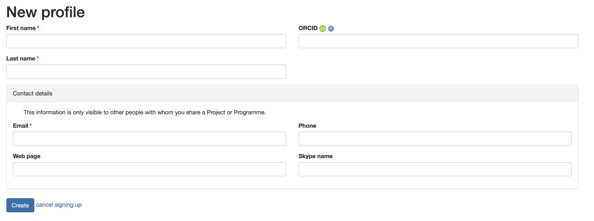
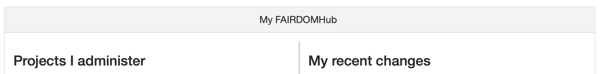

# UNDER DEVELOPMENT

# Getting Started

This guide walks you through creating an account and navigating FAIRDOM-SEEK.

## Creating an Account

1. Navigate to your SEEK instance (e.g., [FAIRDOMHub](https://fairdomhub.org))
2. Click **Sign up** in the top right corner
3. Fill in your details:
   - Username
   - Email address
   - Password
4. Verify your email address
5. Complete your profile

***The account registration screen looks like this:***

***The profile completion screen looks like this:***

## The Dashboard

After logging in, you'll see the main dashboard with:

- **My recent changes** - Latest updates from your projects
- **Projects I administer** - Quick access to your work
- **Latest additions** - Explore public content

## Navigation

The main menu provides access to:

| Menu Item      | Description                     |
|----------------|---------------------------------|
| **Create**     | Add new projects, data, models  |
| **Browse**     | Explore all asset types         |
| **Search**     | Find specific content           |
| **My Profile** | Your settings and contributions |

## Your Profile

Complete your profile to help collaborators find you:

- Add your institution
- List your expertise
- Link your ORCID

## Next Steps

Learn about the [ISA Structure](isa-structure.md) to organize your research.
