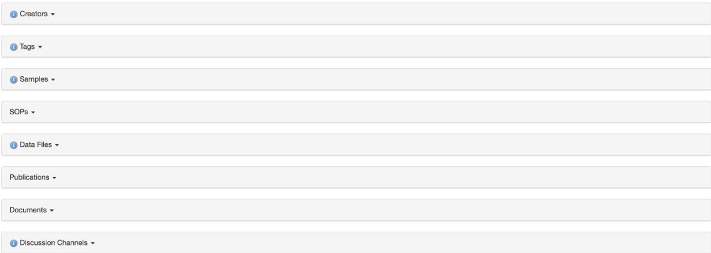

# Populating a Project: ISA Structure

## Purpose

To populate a project with the experimental information organising your data and related information.

Once your project has been created you are now ready to populate your project and create the ISA (Investigation,Study, Assay) structure

### There are multiple ways of doing this

1. You can either create this structure manually OR
2. Use the FAIR Data Sation

## Populating the project Manually

This is where we will create the ISA structure. The ISA (Investigation, Study, Assay) is a general purpose framework for describing how experiments relate to one another.

### Step 1: Create and Investigation

Click on the “Create” tab and from the pull-down menu select “Investigation” and a New Investigation page will open. Fill in the following sections with relevant information:

#### Title

Investigation Name: Understanding the extracellular environment in Aspergillus niger

#### Description

An experimental validation of the predicted proteome confirmed in silico predictions.

#### Extended metadata

##### If applicable

Investigation position:

You can specify the position you want this Investigation to have on the tree : 1

#### Project

Assign the Investigation to the project created

##### Sharing

Add the sharing permissions you want to associate with the project

Here you can specify who can view the summary of and edit the Investigation

|                                                 | No Access | View | Edit | Manage |
|-------------------------------------------------|-----------|------|------|--------|
| Public                                          | ○         | ✓    |      |        |
| An inventory of the Aspergillus niger secretome | ○         | ✓    | ○    | ○      |
| Share with a Person                             | ○         | ○    | ○    | ○      |
| Share with a Project / Institution              | ○         | ○    | ○    | ○      |
| Share with a Programme                          | ○         | ○    | ○    | ○      |

#### Creators

Add other creators e.g. co-investigators to the investigation. You can add as many as you like.

#### Publications

Add any relevant publications that will come out of this project or the ones this project is based on.

Hit the Create button and your Investigation will be created.

### Step 2: Create the Study

A study is a particular biological hypothesis or analysis. Multiple studies can be connected to an investigation. After the Investigation has been created you will now create a Study and associate it with the Investigation created above.

Click on the “Create” tab and from the pull-down menu select “Study” OR from the Investigation created above click on the Add new button and a New Study page will appear.

Fill in the relevant sections like in the Investigation above:

**Title:**

In silico prediction

**Description:**

Extended metadata: *If applicable*

**Study position:**

You can specify the position you want this Study to have under the Investigation: 1

**Project:**

Assign the Investigation to the project created

**Sharing:**

**Creators:**

**Publications:**

### Step 3: Create the Assays

Multiple assays can be connected to a Study. Experimental assays refer specifically to laboratory assays.

Click on the “Create” tab and from the pull-down menu select “Assay” OR from the Study created above click on the Add new button and select Add new Assay

Fill in the relevant sections like in the Investigation above:

**Title:**

Signal Peptide Predictions

**Description:**

**Extended metadata:**

*If applicable*

**Study position:**

You can specify the position you want this Study to have under the Investigation: 1

**Project:**

Assign the Investigation to the project created

**Sharing:**

**Creators:**

**Publications:**

