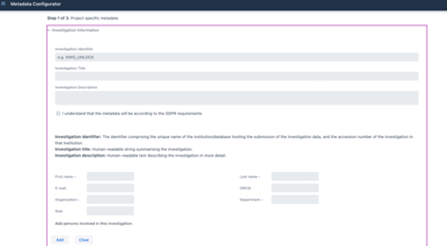
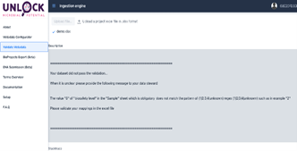
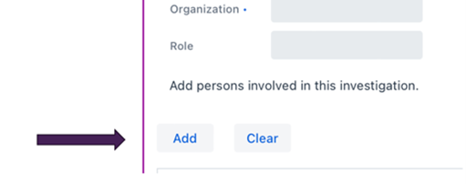
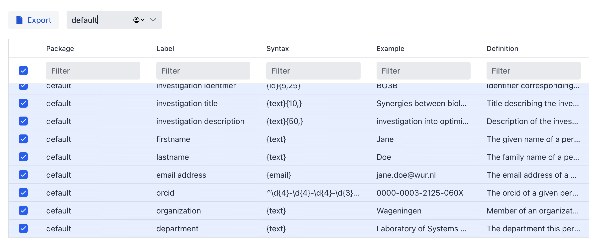
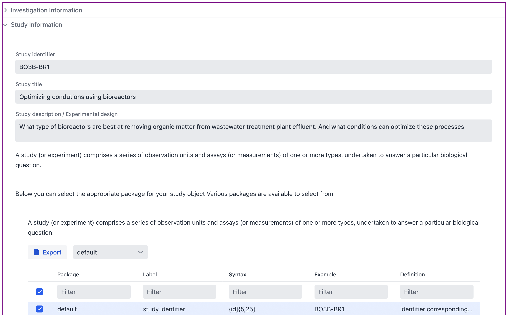
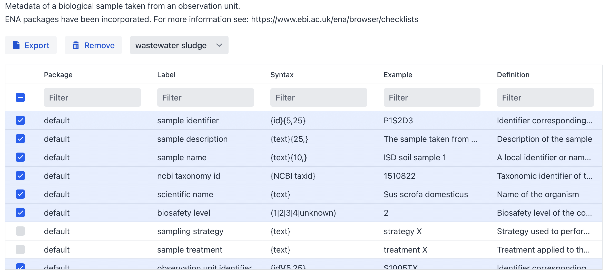
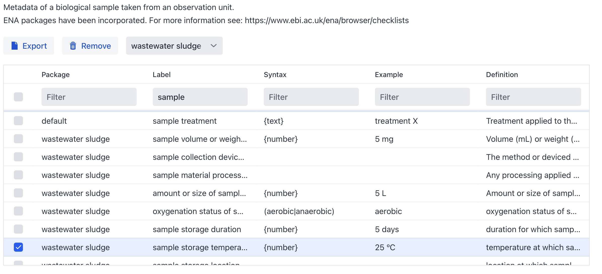

# Metadata Configurator

## Introduction

The ISA metadata framework standard specifies an abstract model to capture experimental metadata using three core levels, **Investigation**, **Study** and **Assay**.

The FAIR DS organises this metadata according to this standard. The **‘Investigation’** level provides the project context. A **‘Study**' is a unit of research and an '**Assay**' an analytical measurement.

In this workshop we will follow the example of a study performed at Wageningen University of which has been published under Project number [PRJEB54921](https://www.ebi.ac.uk/ena/browser/view/PRJEB54921).

So, let’s pretend we are about to start this Investigation. We define the aim of the study, the approach and specify the sample specific metadata. Using a simple four-step process the FAIR Data Station provides guidance on the management of the metadata. The steps are:

1. Selection of appropriate metadata standards resulting in spreadsheet template generation
2. Recording of metadata using the spreadsheet template
3. Validation of metadata content according to template requirements.
4. Data FAIRification through generation of a FAIR machine actionable metadata resource

## Step 1. Provide context to the investigation

Start up the FAIR DS tool available at [https://fairds.fairbydesign.nl](https://fairds.fairbydesign.nl) and click on `Metadata Configurator`

| Step 1 | Step 2 | Step 3 |
|----------|----------|----------|
| Create an ISA metadata Excel template | Recording of your metadata | Validation of registered Field/Value pairs |
|  |  |  |

### Investigation

The `Identifier`,  `Title` and the `Description` of this Investigation would be something like: (you can copy/paste the various items in the Investigation textbox of the FAIR-DS tool).  

> **Identifier:** BO3B  
> **Title:** Synergies between biological and ozonisation processes for micropollutant removal  
> **Description:** Investigation into optimizing micropollutant removal from wastewater treatment plant effluent using biological treatment and ozonation

**Note:** Make sure that when you add (your) name and e-mail you push the **add** button.



#### Package selection (Investigation)

At each level the metadata can vary depending on the packages selected. At the **investigation** level click on **'Select a package'**  and choose **'default'**.



Within a package not all terms have to be selected (by default only **mandatory** and **recommended** terms are selected). Terms from other packages are available to be selected in case you want to mix and match different packages together and re-use terms.

Once this is done you can go to the next section.

### Study

`Now Unfold the Study textbox (At the bottom left of the Investigation textbox).`

In our example there is one **Study** – but you can imagine that there will be a follow-up study at a later stage. Here we add the specifics of the particular study. In this case:

> **Identifier:**   BO3B-BR1  
> **Title:** Optimizing condutions using bioreactors  
> **Description:** What type of bioreactors are best at removing organic matter from wastewater treatment plant effluent. And what conditions can optimize these processes

Paste this text in the textbox, and we have already finished step 1 of 3!

**Figure 2.** Investigation/Study textbox with Investigation in collapsed state



#### Package selection (Study)

As is done for the **investigation** a package needs to be selected for the **study** as well. Select **default** in the dropdown menu.

#### Export the workbook

If you now push `Generate workbook` button it will export the Investigation and Study into an Excel notebook. As is mentioned, the **Observation Unit**, **Sample** and **Assay** can be integrated at a later stage. When you keep the window open we can move and integrate Step 2 directly.

## Step 2: Using the spreadsheet templates

### Observation Unit

Next, we need to define the **Observation Units** (in the official ISA ontology called: source-material) from which the samples (ISA: sample-material) will be taken. An observation unit can be a bioreactor, a plant, river, lake, animal, patients. As you can see it can be extremly diverse.

Let’s unfold **Observation Unit Information**, click the drop-down menu **search a package** and select the ***default*** package. If you click the **Generate workbook** button now it will export a new Excel file containting the **Investigation**, **Study** and **Observation Unit**.

 <!-- and push the **export** button. -->

```{note}
If you click the Export button inside the **Observation Unit**, the program will then export only the observation unit sheet of the complete workbook (Figure 3) which can be handy feature when we may want to amend our experimental design with more groups, but here we need to have the complete workbook first.
```

**Figure 3:** column headers represent interoperable  Field names or attributes


### Sample

On the website we move on to sample level by unfolding **Sample Information** at the bottom left of the textbox.

The FAIR-DS currently has 40+ minimal information models (packages) to choose from and the most appropriate is in this case the "*wastewater sludge*" package. Mandatory Fields are selected by default, others can be selected to further enrich the metadata.

**Figure 4:** wastewater sludge package selection, Mandatory wastewater sludge fields are selected by default.



Let’s go back to the metadata per sample available from the original study. (ENA Accsesion: [SAMEA110403919](https://www.ebi.ac.uk/ena/browser/view/SAMEA110403919))

### Bioreactor Metagenome Sample

| Field | Value |
|-------|-------|
| **Scientific Name** | bioreactor metagenome |
| **Sample Accession** | SAMEA110403919 |
| **Center Name** | Wageningen University |
| **Sample Alias** | MBBR_10.03 |
| **Checklist** | ERC000011 |
| **Sample Title** | sample MBBR 10.03 |
| **Tax Id** | 1076179 |
| **Collection Date** | 2019-10-03 |
| **Country** | Netherlands |
| **Collection Temperature** | 20 degrees Celsius |
| **Collection pH** | 7 |
| **Sampling Strategy** | Using sterilized metal rod, sample from middle of the column, put in Eppendorf and immediately to -80 freezer |
| **Sample Size** | 50 mL |
| **Observation Unit Title** | Moving bed bioreactor |
| **Observation Unit Name** | Moving bed bioreactor |
| **Observation Unit Identifier** | BR1_MBBR |
| **Observation Unit Description** | We have been running three types of bioreactors (BAC, SF and MBBR) at different feed flow speeds (0.25 - 4 L/h) for several months, while monitoring several parameters related to the effluent organic matter (TOC, UV254 absorbance and COD), oxygen and nutrient concentrations in the water |
| **Sample Type** | Effluent |
| **Solid/liquid** | Liquid |
| **Flow Rate (L/h)** | 0.5 |
| **Sample Description** | MBBR effluent 0.5 Liter per Hour liquid |
| **Electron Acceptor Condition** | Aerobic |
| **Sample Process Key** | MBBR Liquid 0.5 |
| **Sample Condition** | Stored at -80 |
| **Local Storage Location** | -80 freezer at environmental technology. Moved to microbiology freezers in December 2019 |
| **Sample Treatment** | 50 mL sample was filtered with a 0.2 μm filter, the filter was stored in an Eppendorf |
| **Material** | 50 mL water |
| **Biosafety Level** | 1 |
| **Other** | The reactors were fed with effluent wastewater treatment plant, with a short pre-aeration with pure oxygen to ensure aerobic conditions. No temperature or pH control |
| **Package Identifier** | UNLOCK_CORE |
| **Package Name** | Core |
| **Sample Identifier** | MBBR_10.03 |
| **Local Region Name** | ETE-WUR, Wageningen |
| **ENA-FIRST-PUBLIC** | 2022-09-30T04:31:19Z |
| **ENA-LAST-UPDATE** | 2022-09-30T04:31:19Z |
| **ENA-CHECKLIST** | ERC000011 |


The selected minimal information model contains field names and the restrictions on the linked values. These restrictions are also directly available in the resultant Excel workbook (Figure 5).

**Figure 5:** Metadata field info box


To increase the interoperability of your metadata you have the option to either systematically review this list, which incidentally helps you identify crucial metadata you might not have considered and could enhance your design, or filter specifically for terms related to in this (Figure 6).

**Figure 6:** Overview of the sample metadata selection (Filter for wastewater sludge and select *sample*)


## Finally, the planned Assays

From the publication we can learn that that 16s rDNA sequences were obtained from bioreactor wastewater experiments.  On the website we move on to "Assay" information by unfolding **Assay Information** at the bottom left of the textbox and select "***Amplicon demultiplexed***". Again, there are mandatory and optional fields for you to customize.

**Figure 7:** Assay metadata field info box.


When you are done you can download the Excel workbook and start filling in your sample metadata.

```{hint}
You can **download** a template Excel workbook created by this tutorial available at: [**here**](https://github.com/ibisba/workshop/raw/refs/heads/main/ibisba_workshops/data/fairds/BO3B-2.xlsx).
```

## Step 3: Metadata Validation

In the next chapter, we will embark on an exploration of the validation tool.
