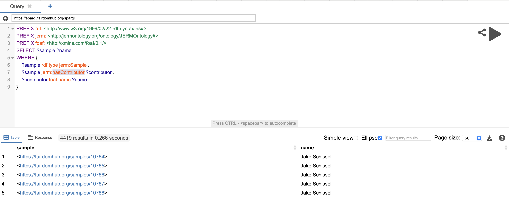

# FAIRDOM-SEEK & Semantic Web

In this tutorial we will show you how you can query a FAIRDOM-SEEK instance using SPARQL. We will use the FAIRDOM-SEEK SPARQL endpoint to query the metadata of the data stored in FAIRDOM-SEEK. 

## Prerequisites

- A FAIRDOM-SEEK instance with data
- A FAIRDOM-SEEK instance with the SPARQL endpoint enabled

## Step 1: Access the SPARQL endpoint

There are multiple ways to access the SPARQL endpoint of your FAIRDOM-SEEK instance. In this tutorial, we will use a query interface that is based on YasGUI and is available through http://yasgui.containers.wur.nl.

1. Open the YasGUI interface at http://yasgui.containers.wur.nl.
2. (optional) Enter the URL of the SPARQL endpoint of your FAIRDOM-SEEK (https://sparql.fairdomhub.org/sparql) instance in the "text bar" just below the Query tab.
3. Enter the SPARQL query in the Query tab.

```sparql
PREFIX rdf: <http://www.w3.org/1999/02/22-rdf-syntax-ns#>
PREFIX jerm: <http://jermontology.org/ontology/JERMOntology#>
PREFIX foaf: <http://xmlns.com/foaf/0.1/>
SELECT ?sample ?name
WHERE {
    ?sample rdf:type jerm:Sample .
    ?sample jerm:hasContributor ?contributor .
    ?contributor foaf:name ?name .
}
```

4. Click on the "BIG ARROW" button to execute the query.
5. The results of the query will be displayed in the Results tab.



There you go! You have successfully queried the metadata of the data stored in FAIRDOM-SEEK using SPARQL.

## Step 2: Try out other queries

You can try out other queries to retrieve different metadata from FAIRDOM-SEEK. Examples are shown in the left panel of the YasGUI interface.

## Step 3: Schema overview

You can find the schema of the FAIRDOM-SEEK instance with the datasets that it currently contains in the public domain in the figure below.

```{image} images/schema.svg
:alt: schema
:class: bg-primary mb-1
:width: 800px
:align: center
```